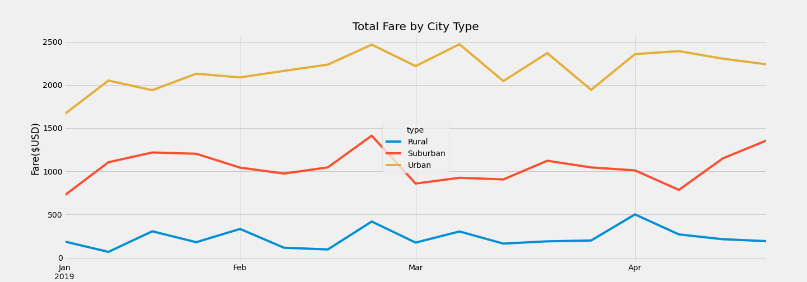

# PyBer_Analysis

## Overview of the Analysis 
The purpose of this project is to run analysis on two csv files, namely, ride_data.csv abd city_data.csv, in order to plot a line graph using object oriented interface method that displays the relationship between total fares and date for each city types. This will ultimately help us determine whether we are allocating our resorces properly amongst the cities in need and optimize profitability. 

## Results
The completion of the analysis is done in several steps. First, I loaded the two csv data files into the progrem and place them in two seperate data frames. Then I merged the two dataframes on the city column. Since every city belongs to a city type, namely, urban, suburban, and rural types, I created five different data series based on city types and merged them into a dataframe that is also based on city types. This gave me a clear view of the data I am working with. Then I edited the dataframe so that it shows the total fares per date (from 2019-01-01 to 2019-04-29) for each city types, and plot the data on a linechart. 

According to our plot, from January 2019 to the end of April 2019, we can see that urban cities has the highest total fares, rural cities has the lowest total fares, and suburban cities are approximately in the middle. Upon closure inspection, we see that urban cities earn approximately five times more total fares than rural cities, and suburban cities earn approximately 3 times more than rural cities. Also, looking further into the graph, we see that at the start of January, total fares earnings are low for urban and suburban cities, and this could be due to a holiday thus people are not using the rides as often as normal work days. We also see that there is a spike in the total fares earned on the last week of February. This could be a country wide event where many people around the country are using cabs to get somewhere. 

## Summery 
First simple suggestion that comes to mind is that we should allocate at least one driver to every city that does not have any driver. This makes sure all the cities have a driver at the bare minimum in case of an emergency for the residents of the city. Secondly, I would like to suggest that we increase the number of drivers to cities that has a higher fare return per drivers to improve profitability. Lastly, since average fare per rides in Rural and Suburban cities are higher than Urban cities, we should consider sending more drivers in these cities until all the prices reach or get very close to an equilibrium for all city types as this would optimize profit.  
